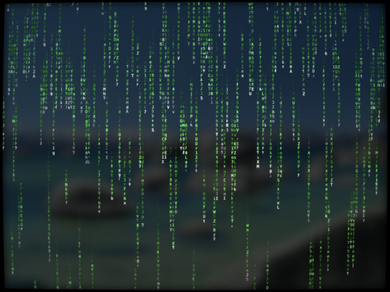

# rsmatrix

Matrix digital rain in your terminal, written in Rust.



## Features

- Multiple character sets (katakana, ASCII, combined), switchable at runtime
- Configurable frame rate (1–60 FPS), adjustable at runtime
- True 24-bit RGB color (consistent across terminal themes)
- Dynamic terminal resize handling
- macOS standalone GUI app with Metal GPU rendering, post-processing effects (bloom, CRT scanlines, background blur), and font zoom
- macOS screensaver with configurable options (charset, font size, effects)
- Linux GTK4 GUI app with fullscreen and font zoom

## Installation

```sh
cargo install --path rsmatrix-cli
```

## Usage

```sh
rsmatrix
```

### Options

| Flag | Description |
|------|-------------|
| `-a`, `--ascii` | Use ASCII/alphanumeric characters only |
| `-k`, `--kana` | Use Japanese half-width katakana only |
| `--fps <N>` | Target frames per second, 1–60 (default: 25) |

### Runtime Keys

| Key | Action |
|-----|--------|
| `q`, `Ctrl+C` | Quit |
| `c` | Clear screen |
| `a` | ASCII only |
| `k` | Katakana only |
| `b` | Combined (kana + ASCII) |
| `+` | Increase FPS |
| `-` | Decrease FPS |
| `=` | Reset FPS to default |
| `Ctrl+L` | Full redraw |

## Linux GTK4 GUI App

Requires GTK4 development libraries:

```sh
# Fedora
sudo dnf install gtk4-devel

# Debian/Ubuntu
sudo apt install libgtk-4-dev
```

Run:

```sh
cargo run -p rsmatrix-gtk
cargo run -p rsmatrix-gtk -- --fullscreen
```

Options: `-a`/`--ascii`, `-k`/`--kana`, `-f`/`--fullscreen`.

| Key | Action |
|-----|--------|
| `q` | Quit |
| `c` | Clear screen |
| `a` | ASCII only |
| `k` | Katakana only |
| `b` | Combined (kana + ASCII) |
| `F11` | Toggle fullscreen |
| `Ctrl+=`/`Ctrl+-` | Font zoom in/out |
| `Ctrl+0` | Reset font size |

## macOS App

Build and run the standalone GUI app (requires Metal-capable Mac):

```sh
make app
make run-app
```

Supports `-a`/`--ascii`, `-k`/`--kana`, `-f`/`--fullscreen` flags.

### Menus

| Menu | Items |
|------|-------|
| **View** | Toggle Fullscreen (`Cmd+F`), Zoom In/Out/Reset (`Cmd+`/`-`/`0`), Renderer: Metal (`Cmd+1`) / CoreText (`Cmd+2`) |
| **Characters** | Combined (`Cmd+B`), ASCII Only (`Cmd+A`), Katakana Only (`Cmd+K`) |
| **Effects** | Bloom (`Cmd+G`), CRT (`Cmd+R`), Background Blur (`Cmd+T`) |

Effects are Metal-only. Background blur shows the desktop wallpaper (blurred and darkened) behind the rain in windowed mode; in fullscreen it captures the wallpaper image as the background.

### Runtime Keys

| Key | Action |
|-----|--------|
| `c` | Clear screen |
| `Escape` | Exit fullscreen |

## macOS Screensaver

Build and install the screensaver bundle:

```sh
make saver
make install-saver
```

Then open **System Settings > Screen Saver** to select MatrixSaver. Click **Options…** to configure:

- **Characters**: Combined / ASCII / Katakana
- **Font Size**: 10–24 pt
- **Effects**: Bloom, CRT scanlines, Background Blur (wallpaper)

> **Note:** On macOS Sonoma (14) and later, Apple's `legacyScreenSaver.appex`
> compatibility layer has known issues that affect all third-party screensavers
> (process not terminating, instances leaking, preview broken). The screensaver
> still works for fullscreen display but may leave a background process running.
> The standalone app (`make run-app`) is the recommended alternative.

## Project Structure

| Crate / Directory | Purpose |
|-------------------|---------|
| `rsmatrix-core` | Platform-agnostic simulation engine (charset, column/stream logic). Only depends on `rand`. |
| `rsmatrix-cli` | Terminal frontend (crossterm rendering, clap CLI args) |
| `rsmatrix-ffi` | C FFI static library for Swift integration |
| `rsmatrix-gtk` | Linux GTK4 GUI app (Pango + Cairo rendering) |
| `macos/` | macOS native code: Metal GPU renderer, CoreText renderer, screensaver bundle, standalone app |

## Acknowledgments

Based on [gomatrix](https://github.com/GeertJohan/gomatrix) by Geert-Johan Riemer.

## License

[BSD 2-Clause](LICENSE)
